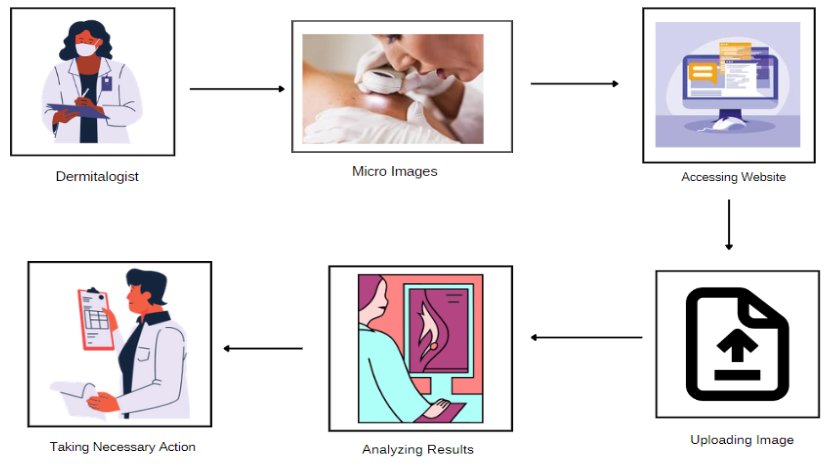
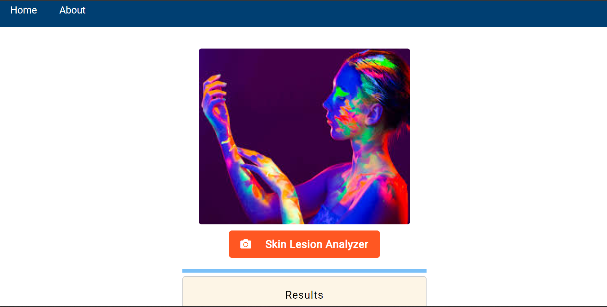
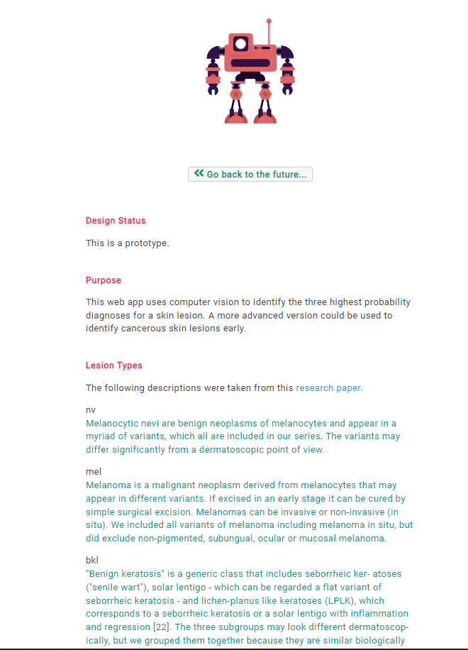
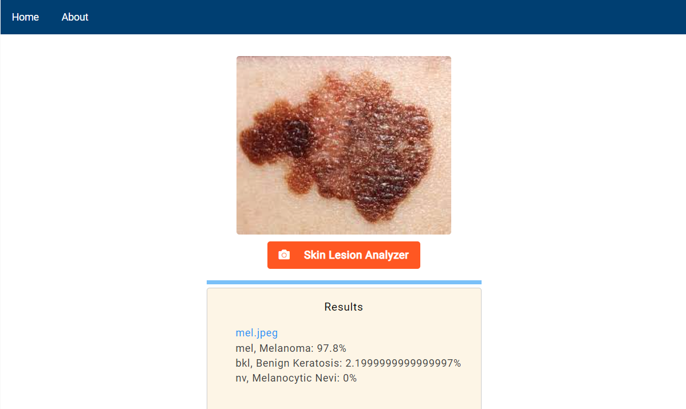

<h1 align="center">Skin Cancer Classification using Computer Aided Diagnosis</h1>

  

## [:film_projector: Presentation Link](https://drive.google.com/file/d/1nW_sdr81doO0MkLUaJE3GxCnLavyh9P_/view?usp=sharing) | [:computer: Website Link](https://skinvision-ai.onrender.com/)

# Abstract

Skin cancer is a prevalent type of cancer worldwide, and early diagnosis is critical for effective treatment. Our system uses a deep learning model trained on a vast dataset of skin images to classify skin cancer into its different types.The model achieves high accuracy and outperforms existing systems. The system can be accessed through a user-friendly web interface, where users can upload skin images and receive a diagnosis in real-time. This AI-based skin cancer classification system has the potential to improve early detection rates and enhance patient outcomes.After integrating in workflow Dermatologists and healthcare professionals can make more informed decisions about the diagnosis and treatment of skin lesions.

# Introduction

Skin cancer is a serious and growing health concern, affecting millions of people worldwide. Early detection and accurate diagnosis are crucial for improving patient outcomes, yet current diagnostic methods can be time-consuming and error-prone. This is where machine learning comes in - by leveraging large amounts of data and powerful algorithms, machine learning has the potential to revolutionize the field of skin cancer classification. In this presentation, we will explore the importance of skin cancer classification using machine learning, including its potential to improve diagnosis accuracy, reduce diagnostic time, and ultimately save lives. We will also examine some of the cutting-edge techniques being used today, as well as some of the challenges and opportunities that lie ahead.

## The problem we tried to solve

_The first step to identify whether the skin lesion is malignant or benign for a dermatologist is to do a skin biopsy. In the skin biopsy, the dermatologist takes some part of the skin lesion and examines it under the microscope. The current process takes almost a week or more, starting from getting a dermatologist appointment to getting a biopsy report. This project aims to shorten the current gap to just a couple of days by providing the predictive model using **Computer-Aided Diagnosis (CAD)**. The approach uses **Convolutional Neural Network (CNN)** to classify nine types of skin cancer from outlier lesions images. This reduction of a gap has the opportunity to impact millions of people positively._

## Motivation

A dermatologist will perform a skin biopsy to determine if the skin lesion is benign or malignant (cancerous).
The dermatologist removes a portion of the skin lesion during the skin biopsy and studies it under a microscope.
Obtaining a dermatologist appointment and receiving a biopsy report currently takes around a week or more.
The goal of this research is to use computer-aided diagnosis (CAD) to provide a prediction model that will reduce the present gap to a matter of days.
The method analyses photos of outlier lesions to classify nine different forms of skin cancer using convolutional neural networks (CNN). This gap closing has the potential to favourably affect millions of individuals.
Our AI model will be able to reach a high level of accuracy and generalization on unseen data, which is an important factor for clinical adoption.

## Data Set

https://www.kaggle.com/datasets/kmader/skin-cancer-mnist-ham10000

## Proposed Methodology

## Results

Fig: Home page for dermitologists to upload skin lesions

Fig: About Page

Fig: Lesion Analysis and Results

## Conclusion

With high levels of accuracy, sensitivity, and specificity achieved by state-of-the-art models, dermatologists and healthcare professionals can make more informed decisions about the diagnosis and treatment of skin lesions, potentially leading to better patient outcomes. The ability of these models to provide quick and accurate diagnoses could also help to reduce patient anxiety and improve overall satisfaction with care.Computer Aided Diagnosis (CAD) that will quickly analyse the data and generate the results and help save lives

## Steps to run this Repository

1. npm install
2. npm start
3. open localhost:3000

# Credits

This project cannot be completed without you guys **Abhishek Shah** [@github/Abhi-000](https://github.com/Abhi-000) and **Anket Patil** [@github/anket11](https://github.com/anket11). Thanks for your support :D
